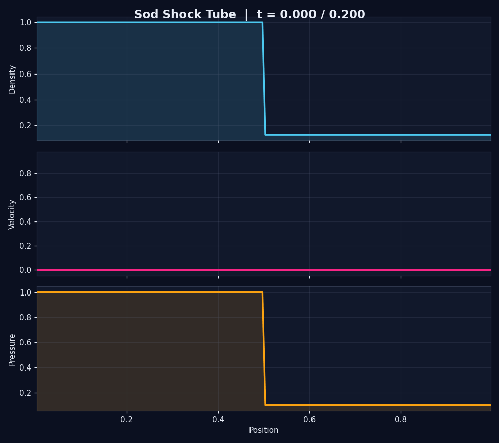

# Python 1D Shock Tube

A compact finite-volume solver for the one-dimensional Sod shock-tube
problem. It evolves the compressible Euler equations using a Rusanov
(local Lax-Friedrichs) numerical flux and transmissive boundary conditions.



## Features

- Animated density, velocity, and pressure fields
- GIF export for easy sharing and portfolio previews
- Configurable resolution, end time, CFL number, frame count, and frame rate
- Reusable solver separated from plotting and command-line code
- Adaptive time stepping based on the CFL stability condition

The default initial state is:

| Region | Density | Pressure | Velocity |
| --- | ---: | ---: | ---: |
| Left | 1.0 | 1.0 | 0.0 |
| Right | 0.125 | 0.1 | 0.0 |

## Run it

Python 3.10 or newer is recommended.

```bash
python -m venv .venv
```

Activate the environment on Windows:

```powershell
.\.venv\Scripts\Activate.ps1
```

Install the dependencies:

```bash
pip install -r requirements.txt
```

Open the final-state plot:

```bash
python main.py
```

Create an animated GIF:

```bash
python main.py --animate output/shock-tube.gif
```

Control the animation length and smoothness:

```bash
python main.py --cells 500 --frames 120 --fps 30 --animate output/shock-tube.gif
```

Save a static result without opening a plot window:

```bash
python main.py --save output/shock-tube.png
```

Run `python main.py --help` for all command-line options.

## Project layout

```text
.
|-- assets/            # GitHub preview animation
|-- main.py            # Command-line interface
|-- shocktube.py       # Numerical solver
|-- visualization.py   # Static and animated plotting
|-- requirements.txt
`-- README.md
```

## Numerical method

The solver uses a first-order finite-volume discretization of the 1D Euler
equations. A Rusanov flux handles the discontinuity robustly, while the time
step is selected from the CFL condition. Animation frames are sampled at
evenly spaced physical times, independent of the solver's adaptive time steps.

The method is intentionally simple and educational rather than optimized for
high-accuracy CFD work.
